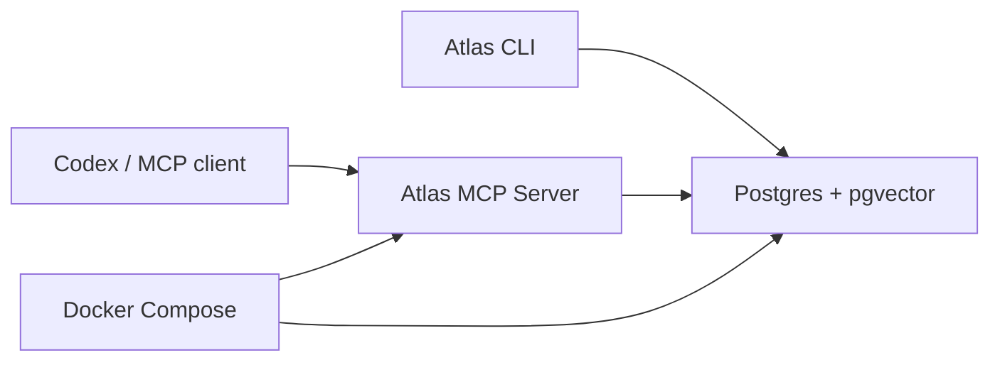

# Atlas Demo Distribution Notes

This repository is a binary demo package.

## Architecture



## Runtime Contract

The MCP server exposes:

- `GET /health`
- `GET /version`
- `GET /cockpit`
- `GET /api/cockpit/overview`
- `GET /api/cockpit/context-pack`
- `POST /mcp`

The default local MCP URL is:

```text
http://127.0.0.1:5391/mcp
```

The local cockpit URL is:

```text
http://127.0.0.1:5391/cockpit
```

## Source-Free Boundary

The package intentionally includes compiled runtime artifacts only. It excludes source code, project files, solution files, debug symbols, and private local data.

## Upgrade Process

From the private Atlas source repository:

1. Build Release binaries.
2. Publish `Atlas.McpServer` into `artifacts/Atlas.McpServer`.
3. Publish `Atlas.Cli` into `artifacts/Atlas.Cli`.
4. Remove `.pdb` files.
5. Regenerate checksums.
6. Smoke test Docker and CLI paths.
